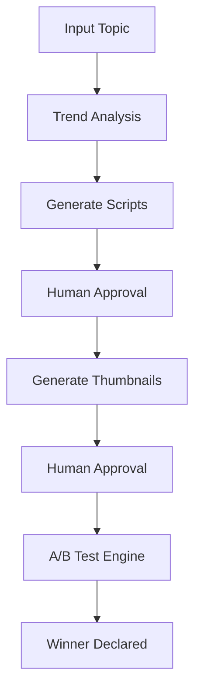

# Creator Agent Toolbox (CAT)

AI-powered content creation with A/B testing optimization.

## What It Does

- Generates 3 script variants optimized for retention
- Creates 3 thumbnail visuals automatically  
- A/B tests combinations with statistical significance (95% confidence)
- Declares winner based on CTR data

## Tech Stack

- Backend: Python 3.11, FastAPI, LangGraph, SQLAlchemy 2.0
- Frontend: React 18, TypeScript, Vite, TailwindCSS, Zustand
- AI: Ollama (local) / Groq API (cloud), Pollinations.ai (thumbnails)
- Database: SQLite (local) / PostgreSQL (production-ready)

## Quick Start (Local)

### Prerequisites

- Python 3.11+
- Node.js 20+
- Ollama installed (optional, for local LLM)

### Backend Setup

```bash
cd backend
python -m venv venv
source venv/bin/activate  # Windows: venv\Scripts\activate
pip install -r requirements.txt
python -m uvicorn app.main:app --reload
```

### Frontend Setup

```bash
cd frontend
npm install
npm run dev
```

### Environment

Copy `.env.example` to `.env` and fill:

- `OPENAI_API_KEY` (for Groq: gsk_...)
- `DATABASE_URL` (defaults to SQLite)

## Architecture



## API Endpoints

- `POST /api/v1/workflows/start` - Create workflow
- `GET /api/v1/workflows/{id}` - Check status
- `POST /api/v1/workflows/{id}/approve` - Approve script
- `POST /api/v1/workflows/{id}/select-thumbnail` - Select visual
- `GET /api/v1/workflows/{id}/ab-status` - A/B test metrics

## Deployment Notes

Code is production-ready for:

- Railway ($5-20/month)
- AWS ECS + RDS ($60-80/month)

*Note: We are using a Hybrid Development Model. Local development uses SQLite and in-memory caching to save resources. When deployed with production environment variables, it seamlessly activates PostgreSQL and Redis.*

## Screenshots

[Placeholder: Dashboard with workflows]
[Placeholder: Review page with script variants]
[Placeholder: A/B Test monitor with CTR chart]

## License

MIT
